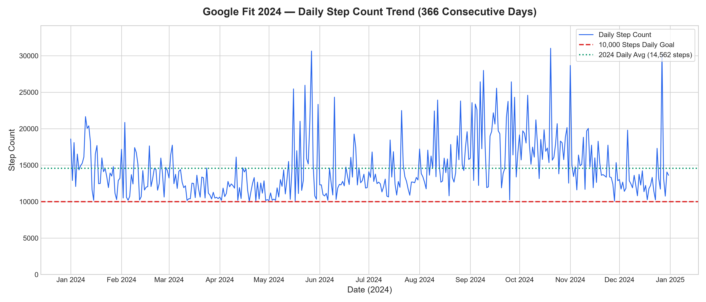
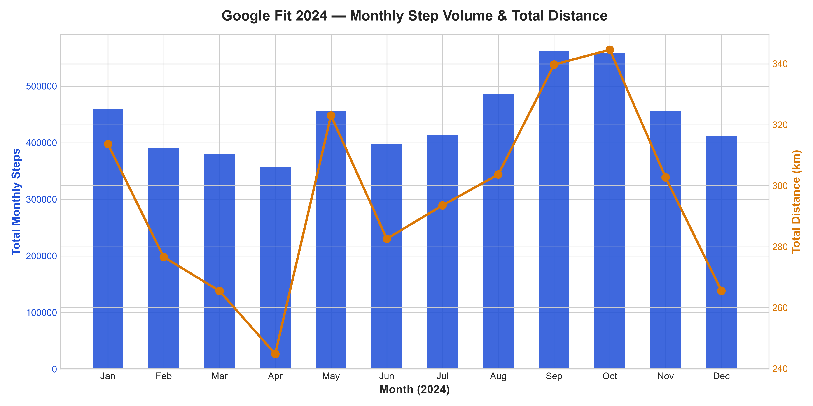
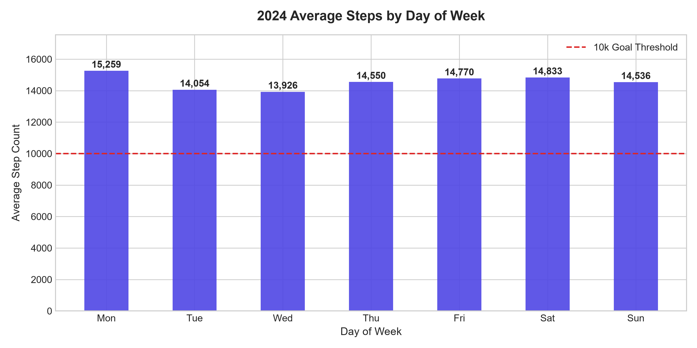
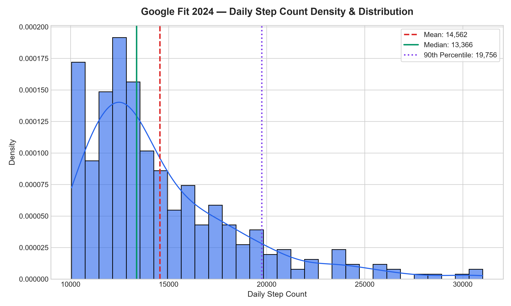
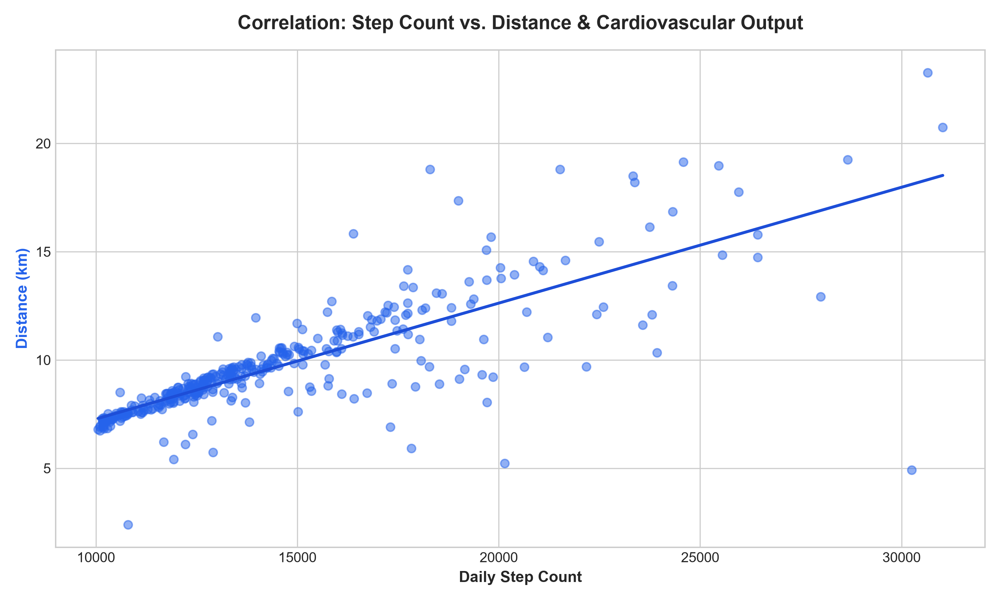
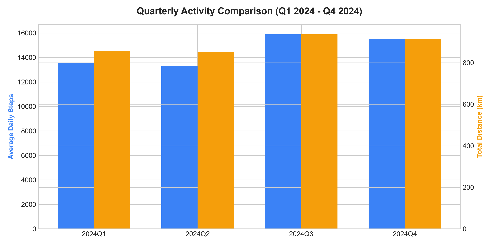
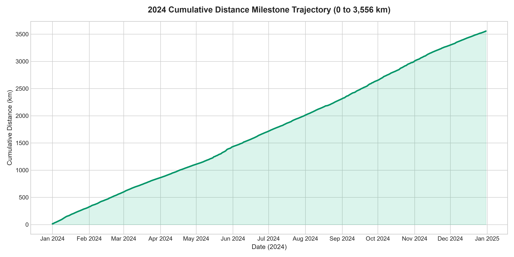

# 🏃‍♂️ Google Fit 2024 — Quantified-Self & Health Analytics

**GitHub Repository**: [https://github.com/Meowshoot/fit2024](https://github.com/Meowshoot/fit2024)

A comprehensive data analytics project analyzing **366 consecutive days** of physical activity tracking telemetry exported from Google Fit during calendar year 2024.

---

## 📌 Project Overview

This project explores daily step count volume, cumulative distance, cardiovascular heart points, and physical consistency metrics recorded during a **366-day personal habit challenge** (2024 Leap Year). The goal was to achieve at least **10,000 steps per day** every single day without interruption.

### 🌟 Key Performance Indicators (KPIs)
* **Total Annual Steps**: **5,329,600 steps** (+45.6% over the 3.66M base goal)
* **Total Distance Covered**: **3,556.19 km**
* **Average Daily Steps**: **14,561.75 steps/day**
* **Goal Consistency**: **100.0% Success Rate (366 / 366 days $\ge 10,000$ steps)**
* **Total Cardiovascular Points**: **37,539 Google Fit Heart Points** ($\mu = 102.57\text{ pts/day}$)
* **Estimated Walking Caloric Output**: $\approx \mathbf{239,832\text{ kcal}}$ ($\approx 31.15\text{ kg}$ fat mass energy equivalent)

---

## 📊 Detailed Statistical Profile

| Metric / Parameter | Value | Description |
| :--- | :--- | :--- |
| **Total Tracked Days** | **366 Days** | Full 2024 Leap Year dataset |
| **Mean Daily Steps ($\mu$)** | **14,561.75** | $\pm 3,954.82$ (Std Dev) |
| **Median Daily Steps ($Q_2$)** | **13,366.50** | Right-skewed distribution ($\text{Skewness} = +1.54$) |
| **Interquartile Range (IQR)** | **4,201.75** | $Q_1 = 11,913.50 \mid Q_3 = 16,115.25$ |
| **90th Percentile ($P_{90}$)** | **19,756.50** | Top 10% of days reached $\sim 20,000$ steps |
| **95th Percentile ($P_{95}$)** | **23,150.75** | Top 5% of days reached $\sim 23,000$ steps |
| **Peak Single-Day Activity** | **31,023 steps** | October 20, 2024 (20.75 km) |
| **Minimum Single-Day Activity** | **10,051 steps** | April 19, 2024 (Exceeded 10k target) |

---

## 🗓️ Quarterly Activity Progression

| Quarter | Days | Total Steps | Avg Steps/Day | Total Dist (km) | Total Heart Pts | Key Highlight |
| :--- | :--- | :--- | :--- | :--- | :--- | :--- |
| **Q1 2024** | 91 | 1,231,464 | 13,532.57 | 855.82 km | 7,013 | Baseline habit building |
| **Q2 2024** | 91 | 1,210,337 | 13,300.41 | 850.45 km | 6,749 | Steady maintenance |
| **Q3 2024** | 92 | **1,462,276** | **15,894.30** | **937.00 km** | 11,258 | **+19.5% Volume Surge** |
| **Q4 2024** | 92 | 1,425,523 | 15,494.82 | 912.92 km | **12,519** | **Peak Intensity (136 pts/day)** |

---

## 🏆 Top Peak Activity Days

1. **2024-10-20**: **31,023 steps** | 20.75 km | 232 Heart Points
2. **2024-05-27**: **30,646 steps** | 23.27 km | 284 Heart Points
3. **2024-12-27**: **30,250 steps** | 4.92 km | 51 Heart Points
4. **2024-11-01**: **28,664 steps** | 19.25 km | 245 Heart Points
5. **2024-09-09**: **27,990 steps** | 12.92 km | 70 Heart Points

---

## 🖼️ Visualizations

### 1. 366-Day Daily Step Count Trend


### 2. Monthly Step Volume & Distance Breakdown


### 3. Activity Distribution by Day of Week


### 4. Step Count Density & Distribution (KDE)


### 5. Correlation: Step Count vs. Distance


### 6. Quarterly KPI Comparison


### 7. Cumulative Distance Milestone Curve


---

## 📁 Repository Structure

```text
├── data/
│   └── google_fit_2024_daily_metrics.csv   # Filtered daily dataset (366 rows)
├── assets/
│   ├── 01_daily_step_trends_2024.png
│   ├── 02_monthly_distance_and_steps.png
│   ├── 03_day_of_week_activity_profile.png
│   ├── 04_step_distribution_histogram_kde.png
│   ├── 05_step_distance_correlation.png
│   ├── 06_quarterly_kpi_comparison.png
│   └── 07_cumulative_distance_milestones.png
├── src/
│   ├── process_fit_data.py                 # Data extraction and cleaning script
│   └── deep_fit_analytics.py               # Statistical analytics script
├── analysis.ipynb                          # Interactive Jupyter Notebook
├── requirements.txt                        # Dependencies (pandas, numpy, matplotlib, seaborn)
└── README.md                               # Project documentation
```

---

## 🚀 Getting Started

1. Clone the repository:
   ```bash
   git clone https://github.com/Meowshoot/fit2024.git
   cd fit2024
   ```
2. Install dependencies:
   ```bash
   pip install -r requirements.txt
   ```
3. Open the interactive notebook:
   ```bash
   jupyter notebook analysis.ipynb
   ```
